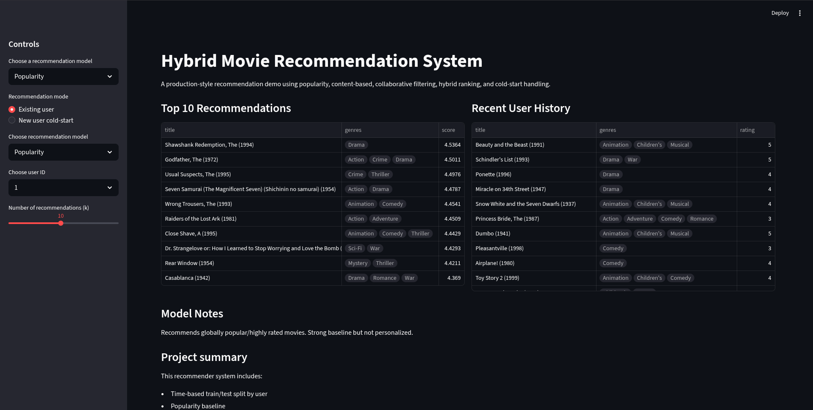

# 🎬 Hybrid Movie Recommendation System

A production-style recommendation system that implements and evaluates multiple recommendation approaches, including popularity-based, content-based, collaborative filtering, and hybrid models, with real-world considerations such as cold-start handling and ranking-based evaluation

---

## Overview

This project builds an end-to-end recommender system using the MovieLens dataset.
It explores different recommendation strategies and compares their performance using ranking metrics.

The system includes:
- Multiple recommendation models
- Hybrid ranking system
- Cold-start handling
- Interactive streamlit demo

---

## Models Implemented

### 1. Popularity-Based
- Recommends globally popular and highly-rated movies
- Uses bayesian / weight scoring
- Strong baseline but not personalized

### 2. Content-Based
- Uses movie genres to build user preference profiles
- Recommends movies similar to previously liked items
- Limited by feature richness (genre only)

### 3. Item-Based Collaborative Filtering
- Uses user-item interaction patterns
- Computes similarity between movies based on user ratings
- Captures behavioral patterns across users

### 4. Hybrid Recommender
- Combines:
    - Collaborative filtering
    - Content-based similarity
    - Popularity prior
- Tuned via weighted scoring

### 5. Cold-Start Hybrid
- Handles real-world edge cases:
    - New users -> popularity-based fallback
    - Sparse users -> content-based fallback
    - Active users -> hybrid recommendations

---

## Evaluation

Models are evaluated using ranking-based metrics:

- Precision@K
- Recall@K
- NDCG@K

### Results

| Model                  | Precision@10 | Recall@10 | NDCG@10 |
|-----------------------|-------------|----------|---------|
| Item Collaborative    | 0.1319      | 0.0641   | 0.1470  |
| Hybrid (Tuned)        | 0.1276      | 0.0634   | 0.1424  |
| Popularity (Bayesian) | 0.0544      | 0.0197   | 0.0587  |
| Content-Based         | 0.0355      | 0.0170   | 0.0375  |

---

### Key Insights

- **Collaborative filtering outperforms other methods** due to strong behavioral signals
- Content-based filtering underperforms due to limited feature representation (genres only)
- Hybrid models require careful tuning - naive blending can reduce performance
- Cold-start handling is essential for real-world systems

---

## Demo (Streamlit App)

Run the interactive app:

```bash
streamlit run app/streamlit_app.py
```

### Features:

- Select recommendation model
- Choose existing users
- New-user cold-start mode (select favorite movies)
- View recommendations and user history

## Project Structure

```
recommender-system/
│
├── src/
│   ├── data/
│   ├── features/
│   ├── models/
│   ├── evaluation/
├── app/
│   └── streamlit_app.py
├── notebooks/
├── data/
├── requirements.txt
└── README.md
```

## Setup

```bash
git clone https://github.com/YOUR_USERNAME/recommender-system.git
cd recommender-system

python -m venv .venv
source .venv/bin/activate

pip install -r requirements.txt
```

## Dataset

This project uses the MovieLens 1M dataset

Download:
https://grouplens.org/datasets/movielens/1m/

Place files in:`data/raw/ml-1m`

## Future Improvements

- Use richer content features (e.g., embeddings, text, metadata)
- Implement matrix factorization (ALS / neural CF)
- Learn hybrid weights via a ranking model
- Deploy the system (API + hosted frontend)

## App Preview
